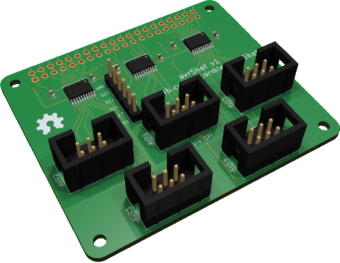

 

# avr5hat
A hat for the Pi that can program up to 5 AVR's at once. The port `AVR1` uses the PI's hardware SPI, the rest are software (bitbang).
Level-shifting from 3.3V to 5V is handled by three TXS0108E.

Heavy inspiration from https://github.com/sparkfun/SparkFun_Pi_AVR_Programmer_HAT


# Flashing Notes
```
#program flash and lock bits
sudo avrdude -p $DEVICE -C /home/pi/avrdude_gpio.conf -c linuxspi -P /dev/spidev0.0 -b 2000000 -D -v -u -U flash:w:$firmware:i -u -U lock:w:$LOCK:m
sudo avrdude -p $DEVICE -C /home/pi/avrdude_gpio.conf -c linuxspi -P /dev/spidev0.0 -b 125000 -D -v -e -u -U hfuse:w:$HIGH_FUSE:m -u -U lfuse:w:$LOW_FUSE:m -u -U efuse:w:$EXT_FUSE:m 2>/home/pi/fuse_results.txt
```

# Pi Setup Notes
##
Make sure to add `dtoverlay=spi0-1cs` to your `/boot/config.txt`


`sudo apt install gpiod`

## Useful links
https://github.com/avrdudes/avrdude/wiki/Building-AVRDUDE-for-Linux

https://learn.adafruit.com/program-an-avr-or-arduino-using-raspberry-pi-gpio-pins/installation


```
sudo apt-get install build-essential git cmake flex bison libelf-dev libusb-dev libhidapi-dev libftdi1-dev libreadline-dev
wget https://github.com/avrdudes/avrdude/archive/refs/tags/v7.1.tar.gz
tar zxvf v7.1.tar.gz && rm v7.1.tar.gz 
cd avrdude-7.1/
cmake -D CMAKE_BUILD_TYPE=RelWithDebInfo -D HAVE_LINUXGPIO=1 -D HAVE_LINUXSPI=1 -B build_linux
cmake --build build_linux
sudo cmake --build build_linux --target install
```

Now when you run `avrdude -c?type` you should see `linuxgpio` and `linuxspi` in the list of valid programmer types.
